# Method and implementation

MSF-ST investigates multi-scale representations for regional SST forecasting. `model/models/msf3_model.py` contains the proposed model family under the internal `MSFv3` name.

```mermaid
flowchart LR
    X[Past SST fields] --> P[Patch tokenizers: 2, 4, 8, 16]
    P --> E[Time and scale embeddings]
    E --> C[Concatenate tokens across scales]
    C --> ST[Spatial attention then temporal attention]
    ST --> H[Per-scale future heads and patch decoding]
    H --> F[Sum or gated scale fusion]
    F --> R[Residual convolutional refinement]
    R --> Y[Future SST fields]
```

## Mapping the hypothesis to code

| Research component | Implementation | What it does |
|---|---|---|
| Multi-scale representation | `MSFormerV3.tokenizers` | Conv2d with kernel/stride equal to patch size; fine scales retain more spatial tokens |
| Time and scale identity | `time_emb`, `scale_emb` | Add learned embeddings before attention; positional embeddings are optional and disabled by default |
| Factorized attention | `FactorizedSTBlock` | Spatial attention over concatenated scale tokens within each time step, then temporal attention per token, then an MLP |
| Future prediction | `future_heads`, `token_to_patch` | Pool time (`last` by default), project to future tokens and decode separate SST fields per scale |
| Fusion | `fusion` | Sum scale predictions, or weight them with a softmax gate derived from pre- or post-Transformer representations |
| Spatial refinement | `smoother` | Four convolutions applied after fusion in a residual connection |
| Spatial-structure objective | `losses.masked_gdl` | Match magnitudes of adjacent horizontal/vertical gradients, only where both pixels are ocean |

The default input/output shapes are `(B, 14, 1, 32, 32)` and `(B, 7, 1, 32, 32)`. At the four default scales, each input field produces 256 + 64 + 16 + 4 = 340 tokens. Attention can therefore exchange information across scales; the scale branches do not use independent Transformer backbones.

## Variants preserved in the release

- `MSFv3`: sum fusion unless explicitly overridden.
- `MSFGv3`: `gated` fusion, with weights calculated before the Transformer.
- `MSFG2v3`: `gated2` fusion, with weights calculated after the Transformer.

`model_train/base/msf3_train.py` chooses the class from `configs.py`. The current default is `gated2`. Changing fusion, embeddings, temporal pooling, scales, or the objective defines a different experiment; the [reported result](experiment_record.md) is not automatically a result for every variant.

For the public default, training uses masked MSE + 0.3 × spatial GDL on normalized fields. The trainer also retains temporal-weighted MSE, temporal GDL, auxiliary-loss, and MoE-monitor support from other experiments. These options are off by default and are not additional claims about MSF-ST.
